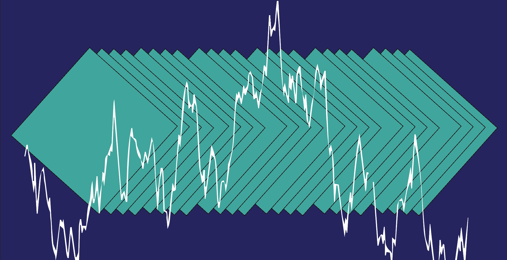
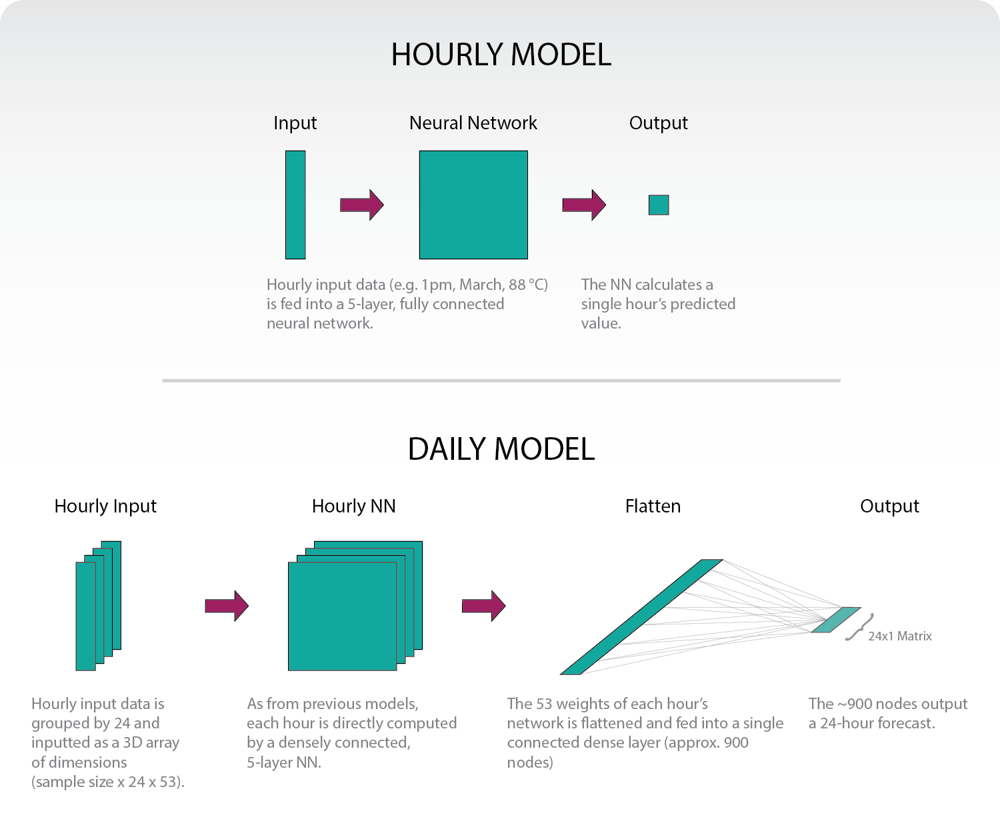
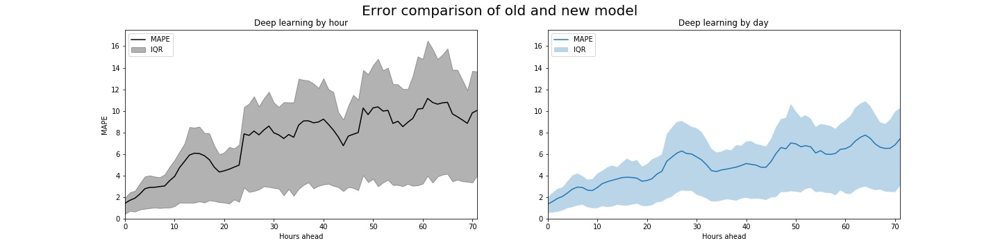

# Predict daily electric consumption with neural networks.

## How a simple three-dimensional structure reduces error, outcompetes more complex models, and doubles savings.

*January 23, 2020*

In early 2019, [we built]({{ site.baseurl }}/simple-load-forecasting.html) a deep learning model that predicted electric consumption on an hour-by-hour basis. Because the smallest error can cost an electric utility tens of thousands of dollars, we explored a number of more complex forecasters. In the end we discovered that a simple day-long approach is the most effective, often cutting error in half.

### Structure



In our previous model, we input all features we believed were relevant to a given hour's load: date, weather data, etc. A neural network then output that single hour's load prediction. This was repeated 72 times to give a 3-day forecast. For a more in-depth explanation, consider reading [the original blog post]({{ site.baseurl }}/simple-load-forecasting.html).

The new structure effectively combines 24 hourly models. But instead of calculating a single hour, we combine all weights into one flat, fully-connected dense layer (we settled on approx. 900 nodes). That layer is then fully connected to a 24-hour vector. We then repeat that over 3-days to give a 72-hour forecast.

#### Why should this work?

The main takeaway should be that the different hours "inform" each other. In our old model, we had a very direct method: given all these factors, what's this single hour's forecast? But in our new model, we can have all the factors that contribute to 4pm's load prediction influence 5pm's load prediction. If it's 30 degrees at 6am, shouldn't that effect whether heaters are still going by 9am? The neural network can identify these complex correlations and provide a more informed prediction.

#### How is this built?

Correctly preparing three-dimensional training data can be tricky. Here is the less-than-elegant function to appropriately group data to the dimensions needed.

```python
def data_transform(data, timesteps, var='x'):
  m = []
  s = data.to_numpy()
  for i in range(s.shape[0]-timesteps):
      m.append(s[i:i+timesteps].tolist())

  if var == 'x':
      t = np.zeros((len(m), len(m[0]), len(m[0][0])))
      for i, x in enumerate(m):
          for j, y in enumerate(x):
              for k, z in enumerate(y):
                  t[i, j, k] = z
  else:
      t = np.zeros((len(m), len(m[0])))
      for i, x in enumerate(m):
          for j, y in enumerate(x):
              t[i, j] = y

  return t

all_y_rnn = data_transform(all_y, HOURS_AHEAD, var='y')
all_X_rnn = data_transform(all_X, HOURS_AHEAD, var='x')
```

It is then fed into the following network:

```python
HOURS_AHEAD = 24
s = all_X.shape[1]

model = tf.keras.Sequential()
model.add(layers.Dense(s, activation=tf.nn.relu, input_shape=(HOURS_AHEAD, all_X.shape[1])))
model.add(layers.Dense(s, activation=tf.nn.relu))
model.add(layers.Dense(s, activation=tf.nn.relu))
model.add(layers.Dense(s, activation=tf.nn.relu))
model.add(layers.Dense(s, activation=tf.nn.relu))
model.add(layers.Flatten())
model.add(layers.Dense(all_X.shape[1]*HOURS_AHEAD//2, activation=tf.nn.relu))
model.add(layers.Dense(HOURS_AHEAD))

nadam = tf.keras.optimizers.Nadam(learning_rate=0.002, beta_1=0.9, beta_2=0.999)
model.compile(optimizer=nadam, loss='mape')
```

#### Why not a RNN?

A recurrent neural network, or RNN, would operate similarly to the network outlined above. But our testing with LSTMs and GRUs (two of the most popular RNN models) was unsuccessful. We were unable to produce models that outcompeted our simplest, hour-by-hour structure. In short, a traditional RNN structure seemed to make things worse.

#### Why 24-hours at a time?

In our short-term forecasting analysis, we often care about load in three-day increments (predictions further out quickly become useless). So why not train on a 72-hour vector? We technically can, but the costs don't outweigh the benefits. On our 24-hour prediction, the daily model runs three times slower than the hourly model, but the returns (as we'll see below) are very high. But as we increase to 48 or 72-hour predictions, the model severely slows with little improvement. At least for our purposes, it is better to separately train three, 24-hour models.

### Results

We tested the new model on Texas's "North Central" region. [The data can be found here.](https://github.com/kmcelwee/load-forecasting/tree/main/data) While in reality the model would train daily, these models were strictly trained on the first 16 years of data (2002–2017) and tested on the final year (2018). To simulate weather forecasting uncertainty, we've added noise to historical weather data-Gaussian distributions with standard distributions of 2.5, 4, and 6 degrees for the 24, 48, and 72 hour groupings respectively.

#### Accuracy

The new model has a mean absolute percent error (MAPE) of 3 while the old model has a MAPE of 4 for the first 24 hours. But the hour-by-hour results are far more compelling.

The most significant issue is not only the MAPE, but the spread of errors (represented below as the interquartile range, or IQR). In developing our first model we discovered that when our hour-by-hour model was wrong, it was often *very* wrong. The reduced variance in the new model can help us communicate our uncertainty more confidently to utilities.



These models presume that the user would predict the following day's electric consumption at 11pm. So "0 Hours ahead" in the chart below would mean "12AM", "30 Hours ahead" is akin to "5AM in two-days", etc.


#### Captured savings

And most importantly, the money saved! A 1 percentage point decrease in error may seem insignificant, but in 2018, this would have doubled Texas's peak shaving savings.

Assuming batteries with a 700kW charge and 500kW rating, we can calculate how much peak shaving could occur with perfect forecasting. You can capture 36 percent of optimal with our hourly neural network model. And by substituting the new model (no fancy [optimization under uncertainty analysis]({{ site.baseurl }}/calculate-uncertainty.html) included), we are able to capture 64 percent, almost doubling our savings!

#### Suggestions welcome!

We were unable to develop a proper RNN that outcompeted our model, but that doesn't mean that one doesn't exist. The smallest increase in accuracy can profoundly help electric utilities, so if you think there's a structure we haven't considered, feel free to reach out!
