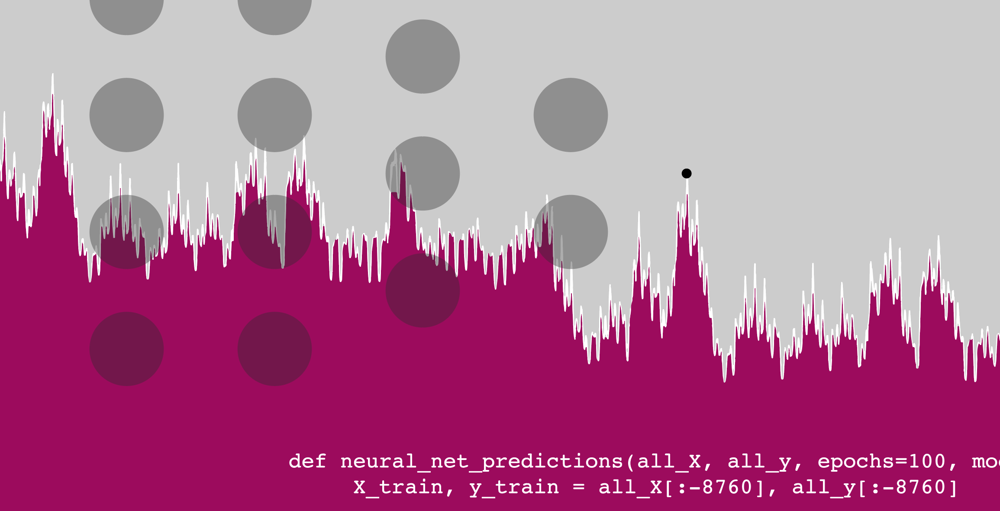
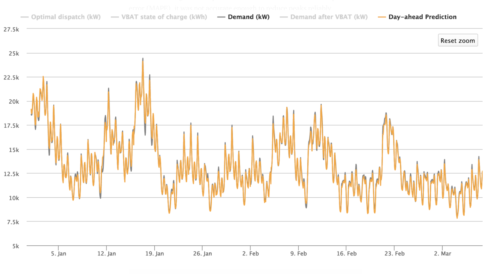

# Using neural nets to predict tomorrow’s electric consumption
## The smallest error can lose utilities thousands of dollars in a single day. Neural networks can help make sure that doesn’t happen.
*March 7, 2019*

Electricity distributors stand to save hundreds of thousands of dollars by decreasing their peak demand charge. Some have tried to discharge batteries or turn off customers’ water heaters or air conditioners at peak hours to reduce their demand. But these efforts are only as effective as the utility’s ability to predict the day’s energy consumption.

The smallest inaccuracy can mean the difference between tens of thousands of dollars—implementing a peak-shaving strategy with incorrect load predictions can even *increase* demand cost. Thankfully, advances in deep learning and neural networks can offer utilities an incredibly accurate picture of the next day’s energy consumption. The Open Modeling Framework (OMF) and I have used neural networks to create a day-ahead load forecasting model that can be easily implemented to inform dispatch decisions.

### Why not something simpler?

We initially created a linear regression model with the python package [scikit-learn](https://scikit-learn.org/stable/). Although this simpler model achieved 10 mean absolute percent error (MAPE), it was not accurate enough to reduce peaks reliably.

The biggest obstacle was the difference in daily peaks between winter and summer months. Winter months peaked twice a day and summer months peaked in the middle of the day. A linear model cannot create these two daily load shapes at the same time. While linear regression can find simple relationships (+500kW because it’s Monday, -100kW because it’s March), a neural network can calculate more complicated relationships (+5100kW because it’s 3pm on a Monday in April, -1500kW because it’s 5am on Thanksgiving). This reduced our training error to roughly 3.5 MAPE, which translated to tens of thousands of dollars saved.



### Software Details

In order to incorporate the load forecast software into the OMF database, our model is written in Python. We use the pandas package to manipulate data, and we have implemented Tensorflow’s Keras (Google’s machine learning software) to create a neural network. [Here is a link](https://github.com/kmcelwee/load-forecasting) to the repository. The code is easy to use:

```python
import loadForecast as fc
import pandas as pd

df = pd.read_csv("test.csv")
all_X = fc.makeUsefulDf(df)
all_y = df["load"]
predictions, accuracy = fc.neural_net_predictions(all_X, all_y)
```

For our initial testing purposes, `neural_net_predictions` simply returns the predictions for the final year; however, it can be quickly updated to work for a utility in real-time.

### Structure

The structure of the neural network is continually being updated as we search for more accurate and efficient methods; however, we have currently settled on a five-layer, fully-connected network where each layer contains 71 nodes. We use a ReLU function in each layer and are minimizing mean squared error.

### Inputs

We recommend that the model train on at least three years of data. The model takes a CSV as input, where each row lists the load and weather for a given year, month, day, and hour. If a utility doesn’t have temperature data available, OMF also offers “weatherPull,” a program that can easily collect and return hourly weather for a given zip code. If there are any null temperature values, the load forecast function uses the “forward fill” method, where null values are replaced by the last non-null value. For example, “38, 39, 41, NaN, NaN, 38, NaN, 32” would be read as “38, 39, 41, 41, 41, 38, 38, 32.”

### Features

Although each training example contains the date, temperature, and weather data, we expand these three columns into 71 features that are useful for a machine learning model. Here is a list of all features:

- Years since 2000*
- Load from 24 hours before*
- Hour of day (`is12AM`, `is1AM`, … `is11PM`)
- Day of the week (`isSunday`, `isMonday`, … `isSaturday`)
- Month of the year (`isJanuary`, `isFebruary`, … `isDecember`)
- Temperature* **
- Temperature² ***
- Previous day’s load* (12AM of day previous, 1AM of day previous, … 11PM of day previous)
- Holidays (the NERC6 holidays)**** (`isNewYears`, `isMemorialDay`, … `isChristmas`)

\*These features are normalized by subtracting from the mean and dividing by the standard deviation, which helps collect all data points closely around zero. By dividing by the standard deviation instead of the range (as recommended when there are large outliers), we improved accuracy by one percent.

\*\*The National Weather Service estimates that their day-ahead hourly weather forecast is often within 2.5 degrees. To replicate this, we create noise in the training and test temperature data by adding a gaussian distribution centered at zero with the standard deviation of 2.5. When this noise was added, the accuracy of the model dropped by one percent.

\*\*\*If you graph load against temperature, you’ll see that load is proportional to temperature²—heaters are used in the coldest temperatures and air conditioners in the hottest temperatures. By adding a temperature² feature, we can make this relationship more obvious to the model.

\*\*\*\*Observed holidays are also “1” (or “True”). For example, Independence Day 2015 was on a Saturday, so it was observed on Friday, July 3. Both July 3 and July 4 for 2015 are marked as “1” for the “isIndependenceDay” feature.

### Results

We trained this neural net on ERCOT’s Houston data from 2002–2017 and tested the model against the load for 2018. We achieved roughly 96.5 percent accuracy (3.5 MAPE). The entire program often runs within 10 minutes. We deployed this neural net on a demand reduction model with a utility using batteries to shift load to reduce demand and found that we saved 40 percent of the optimal solution (e.g. if everything ran perfectly, the utility would save $95,000 on demand charge, but because forecasting isn’t perfect, it saved approximately $40,000. This assumes the typical $20/kW demand charge. Demand charge, among other values, is an input to our cost-benefit model, and we’re in process of extending these results to other utilities.)

There are more complicated machine learning structures that we are currently pursuing, given that the smallest improvements can have such a profound effect on a utility’s bottom line.

Also, it costs money to charge and discharge these large batteries, and some utilities can control their customers’ air conditioners a limited number of days. The next step in our research is to best predict what day of the month to dispatch these methods (assuming the demand charge is monthly), so that utilities can be as conservative as possible.
